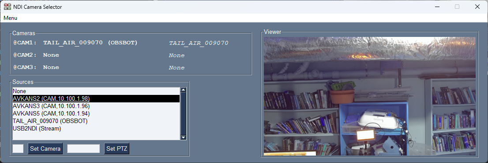

# NDI-Camera-Selector
A tool to support dynamically switching between NDI PTZ cameras (or other sources) in a live-stream setup

## Introduction

*NDI Camera Selector* is intended to be used in a live-stream, or other video production, station based on PTZ cameras using the [NDI](https://ndi.video/) video over IP protocol.

It can be used as part of a setup including my [VISCA Game Controller application](https://github.com/DanTappan/VISCA-Game-Controller)

It supports the following features:

- the ability to dynamically select between the NDI video sources (e.g. PTZ cameras) on the LAN, and map them into *N* slots: CAM1-CAM*N* (e.g. CAM1, CAM2,...) . This allows the operator to configure a video switching application (such as [OBS](https://obsproject.com/) or [VMix](https://www.vmix.com/)) with a set of video sources or scenes, and dynamically change which cameras appear in each scene
- the ability to route IP VISCA packets, to control the cameras, to the appropriate IP destination for each slot. This allows the operator to statically configure the targets for an IP VISCA Joystick controller, and have the VISCA packets automatically mapped to the current set of selected cameras.
- an additional benefit of this is that many VISCA joystick controllers require that targets be configured by IP address; accessing the camera through the VISCA router allows specifying cameras by name
- to support the case of an NDI camera mounted on a separate Pan/Tilt controller, or when a camera that supports VISCA and HDMI is connected to the network through an HDMI->NDI adaptor, the VISCA target for each camera can be specified separately
- a graphics based interface with persistent configurable parameters

## Use

When run, the application displays the following window

This has the following sections:
- **Cameras** - defines the list of configures camera sources. These will be advertised over NDI as "*Host* (CAM*N*)", through an NDI Router. That is, when a program accesses (e.g.) "**VideoStation (CAM1)**" it will be directed to the camera mapped to the **CAM1** slot. There is also a PTZ control address associated with each camera slot, using UDP port 10000+*N* (e.g. the application listens on port 10001 for VISCA packets intended for CAM1). Any VISCA packets received on this port will be automatically forwarded to port 52381 (currently hardwired) on the PTZ control address associated with the slot; VISCA replies received from the PTZ controller will be forwarded back. The effect is that if you remap (e.g.) CAM1 to a different source, VISCA control packets will automatically be forwarded to/from the new source, invisibly to the Joystick controller.
- **Sources** - lists the set of NDI sources which are visible on the local network via NDI discovery. Currently the application does not support the use of an NDI Discovery Server. Click on a source to select it.
- **Viewer** - displays a snapshot from the current selected NDI source
- to map a source to a camera slot
  - select a source
  - type the number of the slot (1-N) in the text box next to the **Set Camera** button
  - either hit *return* or click on the **Set Camera** button
- to set the address of the VISCA PTZ controller associated with a camera
  - type the name or IP address of the controller into the text box next to the **Set PTZ** button
  - either hit *return* or click on the **Set PTZ** button
 
The window also includes a menu with the following items
- **Refresh** - Clears and refreshes the list of NDI Sources. This is useful in a test environment when sources are being added and removed.
- **Configure** - pops up a configuration dialog which allows setting the number of supported camera slots (currently up to 7)
- **Exit** - exits the program.

### Configuration

The **Configure** menu item (see above) presents the following dialog

- **Camera Count** sets the number of camera forwarders (CAM*1* - CAM*N*) which can be set.
- **Enable Bitfocus Companion Interface** enables switching the **Preview** window on VMix/OBS/ATEM when the program detects that the selected camera has changed
- **Bitfocus Companion Address** selects the address of the machine running BitFocus Companion, if the Companion Interface is enabled
- **Bitfocus Companion Page** selects the button page that will be used for selecting the **Preview** window. See below
- **Save&Exit** saves the current configuration and exits the program, on restart it will use the new parameters
- **Cancel** cancels the configuration without making any changes.

### BitFocus Companion Interface

As noted above, the program has an optional feature to detect when the camera selected by a VISCA controller has changed, and automatically switch the **Preview** window of the streaming software/hardware. 

This is not enabled by default for several reasons:
- It assumes that the setup includes [BitFocus Companion](https://bitfocus.io/companion) with a preconfigured button page, such that selecting Button Column *N* from Row 0 will set the preview window to camera *N*. There is a [sample Companion configuration](Sample.companionconfig) included in the repository which supports BlackMagic ATEM (page 97), VMix (page 98) and OBS (page 99)
- It assumes that the setup includes a single VISCA camera controller, and that the controller will only communicate with one camera at a time. This is probably a common configuraton, but it's not universal.
- If you are using my [VISCA-Game-Controller](https://github.com/DanTappan/VISCA-Game-Controller) application, the feature is redundant

## Installation

A [Windows Installer](https://dantappan.net/projects/#NDI-Camera-Selector) for the latest version is available. Alternatively, clone the repository through Github and go to town.

## Python Packages
- ndi-python
- numpy
- pillow
- psgtray-foss
- pyinstaller
- PySimpleGUI-4-foss
- pystray

## Credits

The program uses the following libraries

- the [NewTek NDI SDK](https://ndi.video/for-developers/ndi-sdk/download/)
- the [NDI-Python](https://pypi.org/project/ndi-python/) library for the NDI SDK. **NOTE** this library currently only supports up to Python 3.10, therefore this program must be built using Python 3.10 or earlier.
- the FOSS version 4 of [PySimpleGUI](https://pysimplegui.com/) GUI library. 
- the program icon is based on [Ptz camera icons created by Freepik - Flaticon](https://www.flaticon.com/free-icons/ptz-camera)
- the program was developed using the [PyCharm Community Edition IDE](https://www.jetbrains.com/pycharm/)
- the Windows installer was created using [InstallForge](https://installforge.net/)
